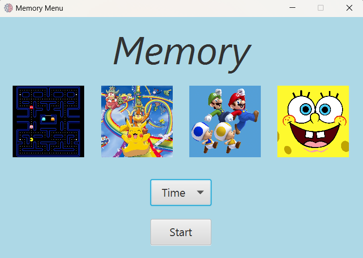

# Memory
### The memory game

In this game you have to find the couples of equals cards.

First you have to manage game settings. You can choose between four themes (PacMan, Pokemon, Supermario, Spongebob) and two game modalities (life or time). 
The game is structured in four levels: the number of cards increases in each level.  